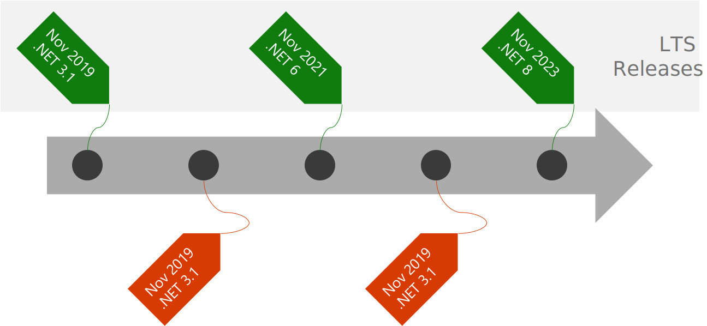

# Getting Started with .NET 5

## Welcome

### AuthorFirst AuthorLast

* ☁️ Qualification
* ☁️ Qualification

<https://social-media.link>

### Agenda

* [.NET History and Roadmap](#net-history-and-roadmap)
* [Installing .NET](#installing-.net)
* [.NET CLI](#net-cli)
* [.NET Projects](#net-projects)
* [Application Types](#application-types)

## .NET History and Roadmap

### The path to .NET 5


::: notes

<https://docs.microsoft.com/dotnet/standard/components>

There are two ways to build applications with .NET

The .NET Framework has been used over many years for .NET applications, services and solutions that run on a variety of Windows systems.

.NET is an offshoot of .NET Framework that focused on building a new .NET implementation from the ground-up with a focus on open-source methodologies, cross-platform support, extensibility, and performance.

For years, there was a feature gap between .NET Framework and .NET but that gap has been narrowed to the point that new solutions can use either “flavor” of .NET.

:::

### .NET 5 platform


::: notes

Since we have two .NETs, the ability to share code between them is critical.

Imagine that you are a library developer and you would like your library to be usable for as many .NET developers as possible.

.NET Standard introduces a common baseline for all .NET solutions.

With the commonality introduced by .NET Standard; you can build libraries, components or tooling that works universally across all of .NET.

There are other “flavors” of .NET that are not shown in this diagram including Mono, Xamarin or Univeral Windows Platform (UWP) as variations of .NET that can share .NET Standard libraries.

:::

### .NET future timeline



::: notes

* .NET Core 3.1 ends the .NET Core roadmap
* Annual releases for .NET
* Ever even-numered release will have long-term support (LTS)
* Schedule is now predictable

:::

### .NET Core

* Cross-platform
* Consistent
  * x86
  * x64
  * ARM
* CLI-centric development
* Flexible deployments
  * Traditional publish
  * Docker containers
  * Self-contained packages
  * Single-file executables
* Open source
* Fully supported for enterprise (<https://dotnet.microsoft.com/platform/support/policy>)

### .NET Standard

* Bridges the gap between yesterday and tomorrow
* Shared namespaces, classes and methods that are **just expected to work**
* Compatible with
  * .NET Framework
  * .NET Core
  * Xamarin
  * Mono
  * Other platforms...

### .NET Standard Platforms


### .NET Standard Classes

* .NET APIs that are available for all compliant .NET implementations
  * Defined as a formal specification of APIs
* Defines Base Class Libraries (BCLs) for all of .NET
* Gives developers a target if they wish to develop a library compatible with all of .NET
* Designed to reduce and eventually eliminate
  * Conditional framework-based compilation
  * Shared source code projects

::: notes

At it’s core, .NET Standard is a definition of APIs that must be implemented by all “flavors” of .NET.

By sharing common base APIs (referred to as the Base Class Libraries), you can ensure that any code you write using those APIs will work across all of .NET

As a library developer, you can quickly target .NET Standard for your library making it usable in .NET Framework and .NET solutions.

:::

### .NET Standard compatibility

| .NET Standard | 1.6 | 2.0 | 2.1 |
| --- | --- | --- | --- |
| .NET Core | 1.0 | 2.0 | 3.0 |
| .NET Framework | 4.6.1 | 4.6.1 | ***N/A*** |
| Mono | 4.6 | 5.4 | 6.4 |
| Xamarin.iOS | 10.0 | 10.14 | 12.16 |
| Xamarin.Mac | 3.0 | 3.8 | 5.16 |
| Xamarin.Android | 7.0 | 8.0 | 10.0 |
| Universal Windows Platform | 10.0.16299 | 10.0.16299 | ***TBD*** |
| Unity | 2018.1 | 2018.1 | ***TBD*** |

::: notes

The .NET Standard specification is a living project with new releases happening regularly.

As the specification is updated to bring in more and more APIs, each “flavor” of .NET implements a new version to become compliant with the latest .NET Standard specification.

With .NET Standard 2.x, many of the APIs you expect in a .NET solution are now available closing the feature gap between .NET Framework and .NET.

* .NET Framework will not support .NET Standard 2.1 or later
* Unity and UWP have not released new versions for .NET Standard 2.1 yet

:::

### Base Class Library Examples

* Types
  * System.Object, System.Int32, System.Decimal, System.Boolean, System.String
* Structures
  * Array, List<>, Dictionary<,>, Uri, DateTime
* Utilities
  * HttpClient, XDocument, StreamReader, StreamWriter
* Even more…
  * AppDomain, Environment, GC, Type

::: notes

The Base Class Libraries defined in .NET Standard include many of the libraries you expect in a standard .NET application.

This slide shows some of the common classes and types that you can use in any .NET “flavor” compliant with .NET Standard 2.x.

:::

### Base Class Library Namespaces

* System.Collections
* System.Diagnostics
* System.Globalization
* System.IO
* System.Security
* System.Text
* System.Threading

::: notes

This slide shows many of the namespaces that are available to you if you are building a .NET Standard library.

You can also infer that these libraries are available in the latest version of .NET Framework and .NET since they are compliant with .NET Standard.

:::

## Installing .NET 5

### .NET 5 Availability

* Available as a preview currently
* Can be installed side-by-side with .NET Core or .NET Framework
* Can be installed side-by-side with other previews

### Sourcing .NET 5

* **Microsoft**: <https://dotnet.microsoft.com/download>
* **GitHub**: <https://github.com/dotnet/installer>

## Demo: Installing .NET 5

::: notes

<https://dotnet.microsoft.com/download>

<https://github.com/dotnet/installer>

:::

## .NET CLI

### .NET Command-Line Interface (CLI)

* Cross-platform command-line interface (CLI) used to develop .NET applications
* Powers higher-level tools “behind the scenes”
  * Integrated Developer Environments
  * Build Orchestrators
  * Editors
  * CI/CD Toolchains

::: notes

<https://docs.microsoft.com/dotnet/core/tools>

The .NET command-line interface (CLI) is a modern way to develop .NET applications.

Using the CLI, you can create solutions, projects, and items from templates in a manner similar to Visual Studio.

You can also use the CLI to build your application, manage NuGet packages, reference other projects, and even publish your application.

The CLI is used “behind the scenes” by other developer tools that support .NET.

For the next few slides, we will assume that we are using the .NET CLI to build a .NET Standard library.

:::

### Invoking the dotnet Command

* All CLI commands start with the ``dotnet`` noun
* Commands typically are built using the following structure:
  * ``dotnet [command] [arguments]``
* Example:
  * ``dotnet build ./project.csproj``

::: notes

<https://docs.microsoft.com/dotnet/core/tools/dotnet>

The main noun used for the CLI is dotnet.

You start every command using the dotnet noun, then add a verb, and then finally add arguments.

In this example, we build a .NET project located in our current directory.

:::

### Creating Items From Templates

```sh
dotnet new [template] # Select a template here
```

### Creating a Solution

```sh
dotnet new sln \ # Solution template
    --name demo \# Name of solution file becomes demo.sln
    --output . # Output into current directory
```

::: notes

<https://docs.microsoft.com/dotnet/core/tools/dotnet-sln>

If you are familiar with developing .NET Framework applications, you may already create solutions for all of your projects.

In this example, we create a new solution using the dotnet new command.

The new command requires a template of what to create, so we specify that we could like to use the sln template to create a blank solution.

The additional arguments include information such as the --name of the solution and the --output folder.

In this example, we create the new solution in our current directory and name it “demo”.

If you do not specify either of the optional arguments, a new solution will be created in your current folder copying the name of the folder as the solution name.

:::

### Solution File (.sln)

* Container used by Integrated Development Environments (IDEs) to organize multiple related projects
  * Opening a solution in Visual Studio automatically opens associated projects

::: notes

Technically, a solution file is only a container used by Integrated Development Environments (IDEs).

You only need to create a solution if you plan on using an IDE, such as Visual Studio, to manage your .NET projects.

In .NET, solutions are optional but not required to build, run and publish your applications.

:::

### Creating a Project within a Solution

```sh
dotnet new classlib \ # Class library template
    --name lib \ # Name of class library
    --output ./lib/ # Output directory

dotnet sln \ # Perform next command in context of the solution
    demo.sln \ # Solution context
    add \ # Verb
    ./lib/lib.csproj # Project to add
```

::: notes

<https://docs.microsoft.com/dotnet/core/tools/dotnet-new>

Once you have a solution, you can start adding projects to it.

In the first example, we use the dotnet new command again to create content using the classlib template, name the project file lib.csproj, and then place the project in the lib folder.

The classlib template will create a new .NET Standard class library project that can be used with .NET or .NET Framework applications.

In the second example, we use the dotnet sln command to reference the demo.sln file and then use the add verb to add the lib/lib.csproj project to the solution.

:::

## Demo: Creating a Simple Library Project

::: notes

TBD

:::

## Building Code

### .NET Build Lifecycle


### Build Workflow using CLI

```sh
# Restores NuGet dependencies
dotnet restore

# Builds project and dependencies
dotnet build

# Runs application
dotnet run
```

### .NET Build Implicit Commands

* ``dotnet build``
  * Will run ``dotnet restore`` automatically
* ``dotnet run``
  * Will run ``dotnet build`` automatically
  * Will run ``dotnet restore`` automatically

### dotnet build

* Default: Will build *.csproj file in current directory
  * **Optional**: Can build *.sln file in current directory
  * **Optional**: You can specify a *.csproj file to build in another directory
* Uses MSBuild "under the hood"
  * Many of the existing MSBuild options still exist
* Can change properties of the .csproj file using the -p parameter

### Build using CLI

```sh
dotnet build \
  --configuration Debug \ # Build configuration
  --runtime ubuntu-arm \ # Build for runtime
  --source X:\packages\nuget \ # Package source (if restoring)
  -p:Version=2.0.0 # <Version> element in *.csproj
```

### Configurations

* Debug
  * Includes debug symbols
  * Allows full debugging
  * No runtime optimizations
* Release
  * No debug symbols
  * Still possible to debug with limitations
  * Runtime optimizations implemented

## Demo: Build .NET Application from the Command Line

::: notes

TBD

:::

## Installing Tools

### .NET Tools

* Special NuGet packages that contain a console application
  * Install on your local machine
  * Use the console application from any terminal
* Tool directory is in your local machine's PATH
* Tools run in full trust mode
* Use with **dotnet** command

### dotnetsay Dotnet Tool

```sh
# Installing dotnetsay
dotnet tool install \ # Verb[s]
    --global \ # Install in default global location
    dotnetsay # Install this package from NuGet

# Use dotnetsay
dotnetsay
```

## Demo: Installing the httprepl Dotnet Tool

::: notes

TBD

:::

## .NET Projects

### Project Structure

* Each project contains a .csproj file
  * Contains metadata about project type
  * Contains references
    * Packages
    * Other projects
  * Contains metadata about the target .NET version
  * Can optionally contain additional metadata

::: notes

In a manner similar to .NET Framework, each .NET application contains projects that are defined by a .csproj file.

In a contrast to .NET Framework, solution files are not required in order to author .NET projects in the IDE of your choice.

The key to remember is that solution files are useful within Visual Studio, and .NET projects aren’t always implemented within Visual Studio.

Project files for .NET solutions contains metadata about:

* The project type
* References to other projects
* References to NuGet pckages
* Metadata about the target .NET version
* Additional metadata as needed

:::

### Creating a Project

```sh
# Class Library
dotnet new classlib \
    --name demo.lib \
    --output ./lib/

# Console Application
dotnet new console \
    --name demo.app \
    --output ./app/
```

::: notes

Creating a new project is as simple as using the dotnet new command.

In the first example, we use the dotnet new command with the classlib template to create a new (.NET Standard) class library project named demo.lib in the lib/ folder

In the second example, we use the same command again with the console template to create a new (.NET) console application project named demo.app in the app/ folder.

:::

### Project Types

| Identifier | Template |
| --- | --- |
| console | Console application |
| classlib | .NET Standard Class Library |
| xunit | Unit Test Project (xUnit) |
| wpf | Windows Presentation Foundation (WPF) |
| winforms | Windows Forms |
| worker | Worker Service |

::: notes

The .NET command-line interface has many different built-in templates for popular application types.

For example, we have used the classlib template to create .NET Standard class library projects.

We have also used the console template to create a .NET console application.

You can use the mstest, xunit, or nunit templates to create Unit Test projects based on the test harness of your choice.

You can also use the wpf or winforms templates to create Windows user interface projects in .NET.

:::

### Web Project Types

| Identifier | Template |
| --- | --- |
| web | ASP.NET (Empty) |
| webapp | ASP.NET Razor Pages |
| mvc | ASP.NET MVC |
| webapi | ASP.NET Web API |
| angular | ASP.NET with Angular |
| react | ASP.NEt with React.js |
| reactredux | ASP.NET with React.js and Redux |
| grpc | ASP.NET gRPC Service |
| blazorserver | ASP.NET Blazor Server-Side |

::: notes

If you want to create a web project, you can use any of the templates listed above.

The web template creates a web project with the minimal configuration needed to host a web server.

The mvc template creates an ASP.NET MVC project, the razor template creates an ASP.NET Razor Pages project, and the webap template creates an ASP.NET Web API project.

The angular, react, and reactredux templates create ASP.NET web projects using the respective JavaScript frameworks.

:::

### Additional Useful Files

| Identifier | Template |
| --- | --- |
| gitignore | .gitignore file |
| sln | Solution file |

### .csproj File

```xml
<!-- Use Microsoft.Net.Sdk.Web for web projects -->
<Project Sdk="Microsoft.NET.Sdk">
    <PropertyGroup>
        <OutputType>Exe</OutputType>
        <TargetFramework>netcoreapp5.0</TargetFramework>
    </PropertyGroup>
</Project>
```

::: notes

While still being XML content, the .csproj file for a .NET or .NET Standard project is considerably simpler to parse with the human eye.

Creating a simpler to manage and read .csproj file was a major goal of the .NET teams when working on .NET.

In this example, the root XML Project element contains an Sdk attribute that defines the type of project with most projects being of type Microsoft.NET.Sdk.

The PropertyGroup child element includes elements for various metadata of the project.

The properties of this project include the TargetFramework element that identifies the version of .NET used to build, execute, and publish this project and the Output element indicating the type of file[s] that should be built by this project.

:::

### .csproj Sections

```xml
<Project Sdk="Microsoft.NET.Sdk">
    <!-- Project Properties -->
    <PropertyGroup>
        <AssemblyName>demoapp</AssemblyName>
        <Version>1.0.0</Version>  
        <OutputType>Exe</OutputType>
        <TargetFramework>netcoreapp5.0</TargetFramework>
    </PropertyGroup>
    <!-- Project References -->
    <ItemGroup>
        <ProjectReference Include="..\lib\demo.lib.csproj" />
    </ItemGroup>
    <!-- NuGet References-->
    <ItemGroup>
        <PackageReference Include="Flurl" Version="2.8.2" />
    </ItemGroup>
    <!-- File[s] Configuration -->
    <ItemGroup>
        <None Include="notes.txt" CopyToOutputDirectory="Always" />
    </ItemGroup>
</Project>
```

::: notes

The previous example is the minimal .csproj needed to build and execute a .NET 3.0 console application.

This example is a more realistic .csproj file.

We will explore each element in depth.

The three ItemGroup child elements could have been combined, they are simply separate for the readability of this sample code.

:::
